Hilbert-video
=============

This project allows you to generate a "map" of a video file, which displays all the frames at once.

The order of the frames on the map is set using the Gilbert curve, which gives automatic clustering of different scenes.

Such visualization allows you to analyze things like:

- The general structure of the movie
- Distribution of the dynamic scenes over the entire artwork
- Color space of video as a whole and individual scenes

Using a library of tile maps allows quick navigation.

Similar researches
==================

- [50 iconic films and their color palettes](https://www.esquire.com/style/news/g2760/color-palettes-iconic-films/)
- [How a Film Color Palette Can Make You a Better Filmmaker](https://nofilmschool.com/Film-color-theory-and-color-schemes)
- [Zena O'Connor](https://zenaoconnor.com.au/instagram-cinema-palettes/), [cinnema.palettes](https://zenaoconnor.com.au/instagram-cinema-palettes/)
- [colorpalette.cinema](https://www.instagram.com/colorpalette.cinema/)
- [filmandcolor](https://www.instagram.com/filmandcolor/)
- [Color Palettes From Famous Movies Show How Colors Set The Mood Of A Film](https://digitalsynopsis.com/design/cinema-palettes-famous-movie-colors/)
- [moviesincolor.com](https://moviesincolor.com/)
- [Wes Anderson-Approved Color Palettes to Try for Your Next OOTD](https://www.preview.ph/fashion/wes-anderson-color-palettes-for-outfits-a141-20200307)
- [Design Lover Reveals Striking Color Palettes of Beloved TV Shows, Films, and Music Videos](https://mymodernmet.com/color-palette-maniac/)
- [Color Theory Goes To The Movies](https://aframe.oscars.org/features/color-theory-goes-to-the-movies)

Some examples
=============

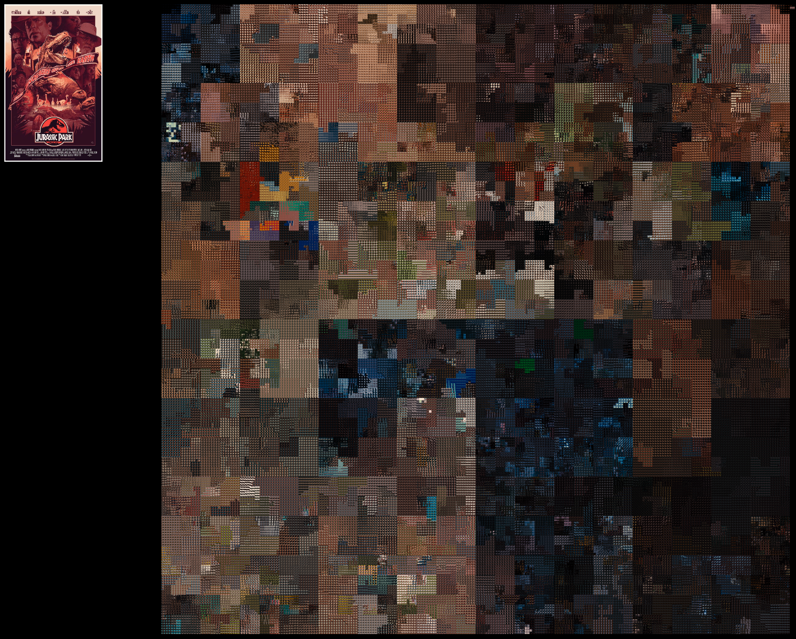

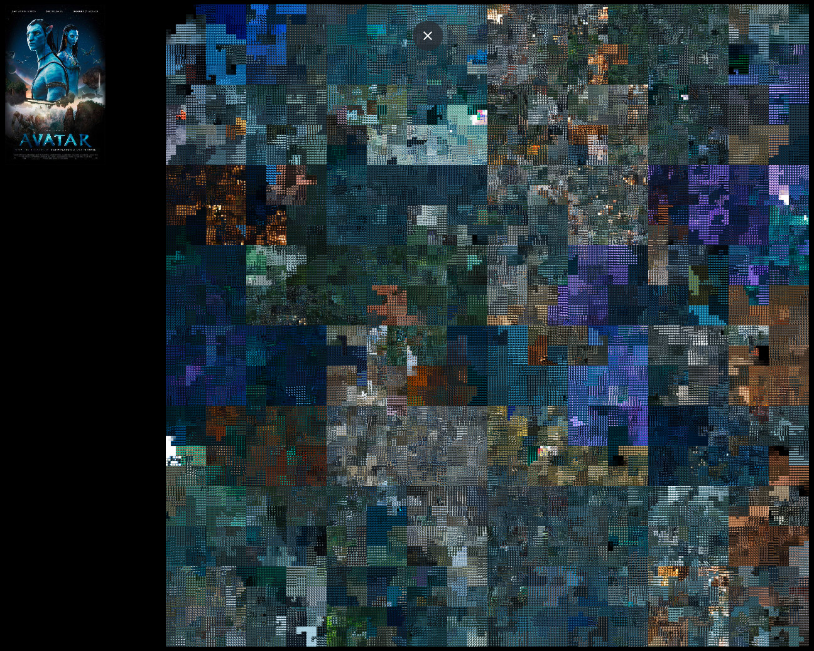
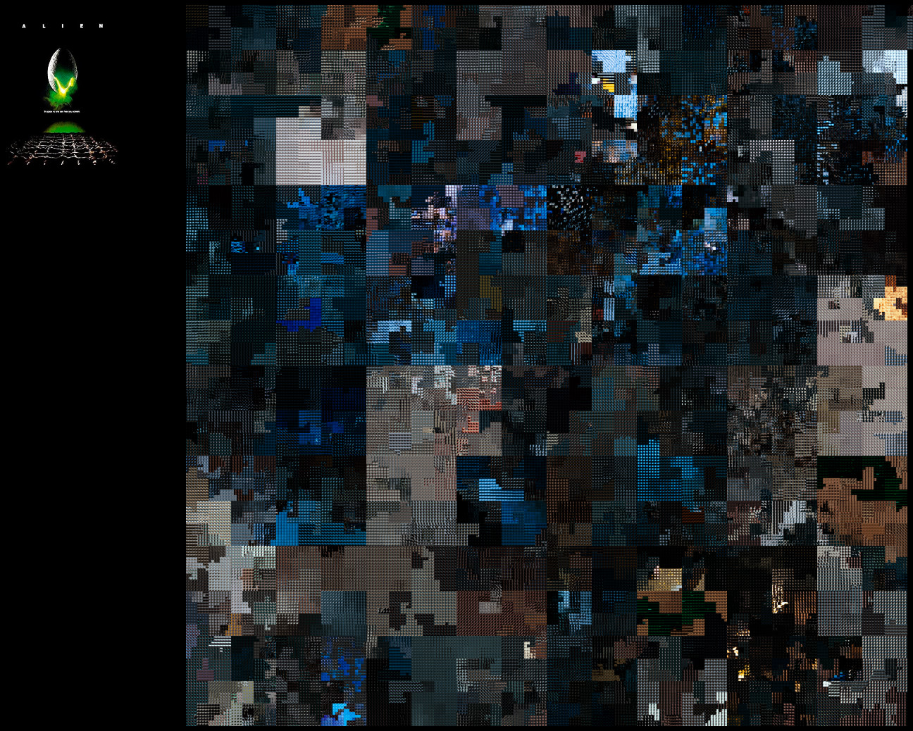
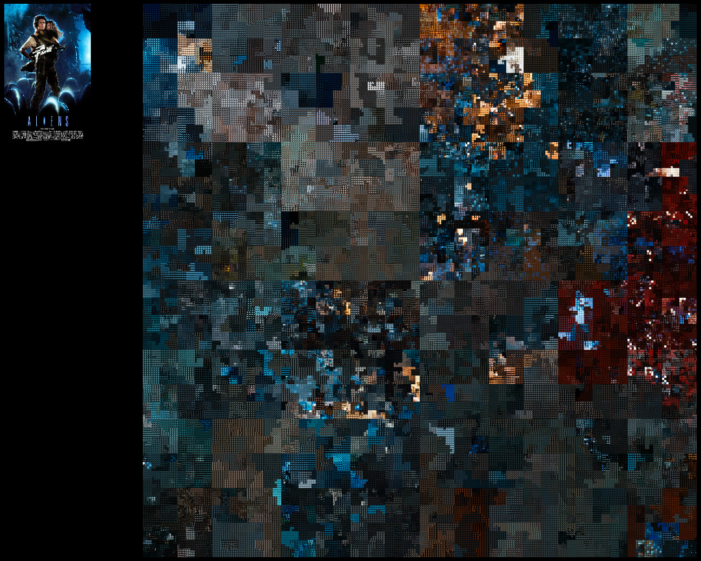
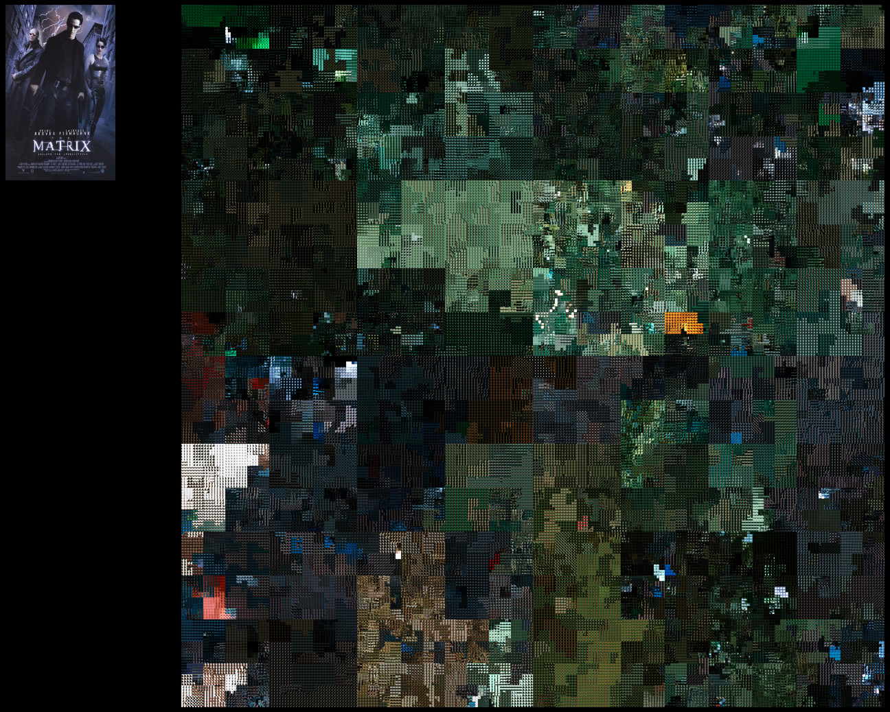
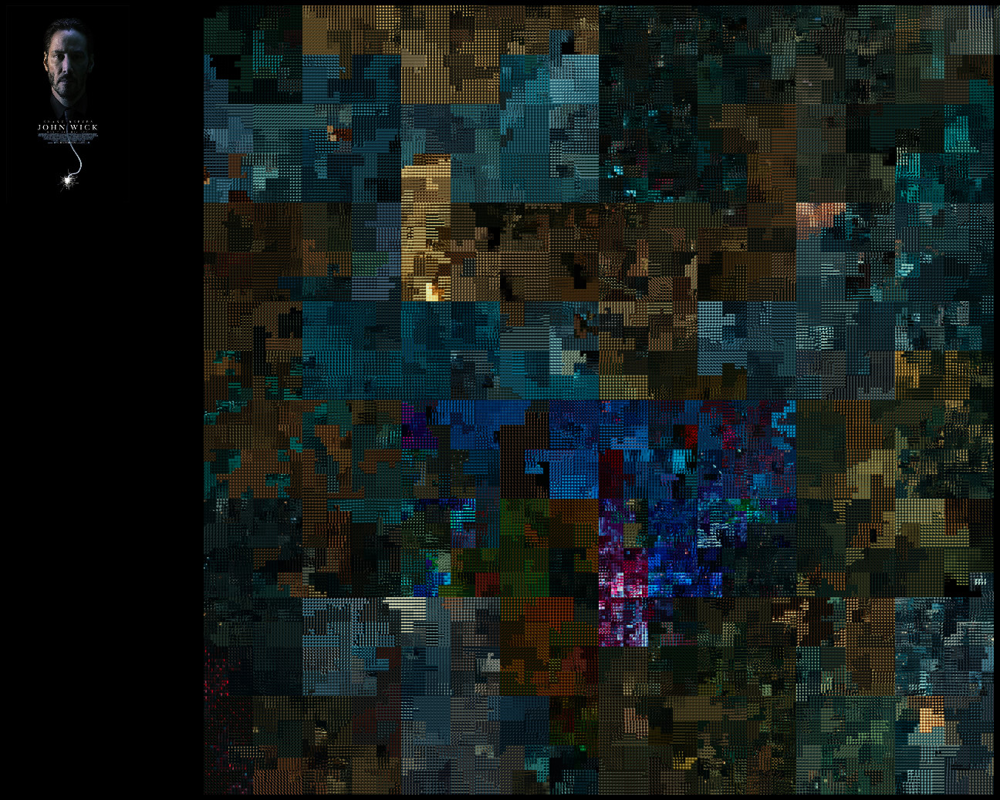
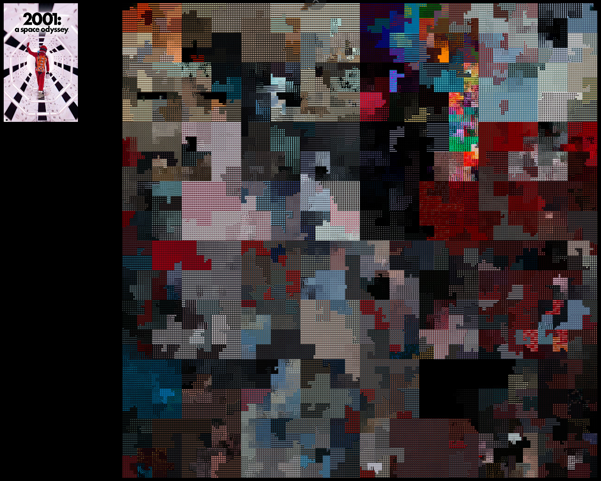
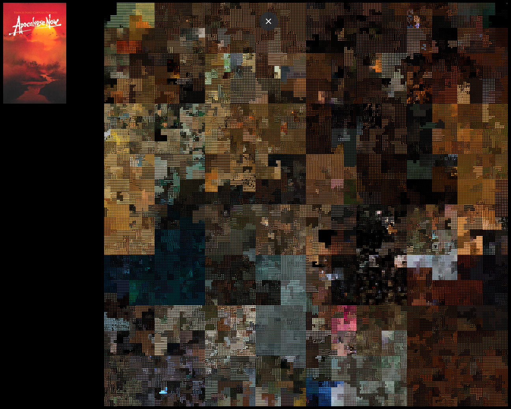
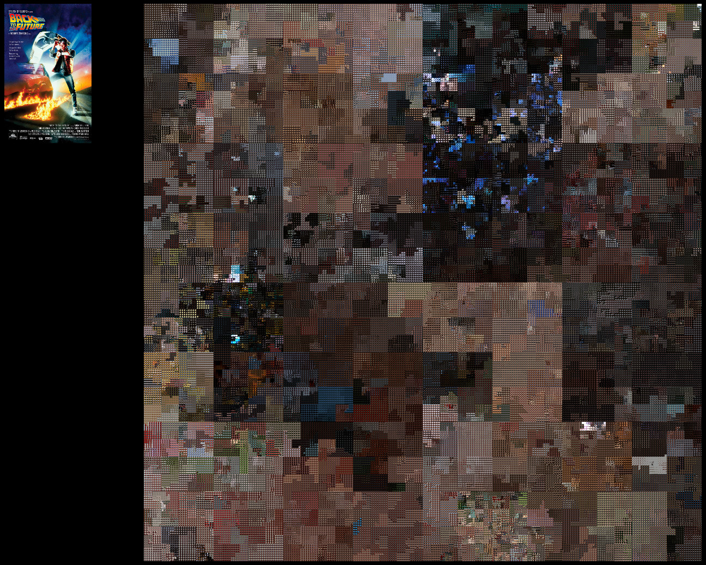
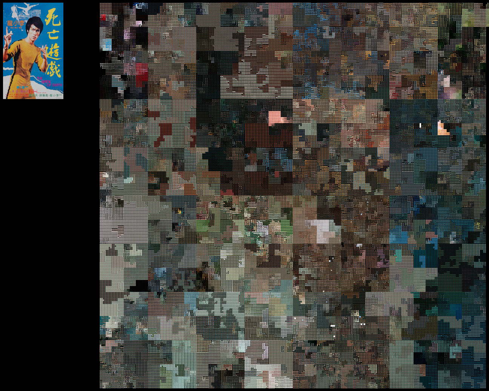
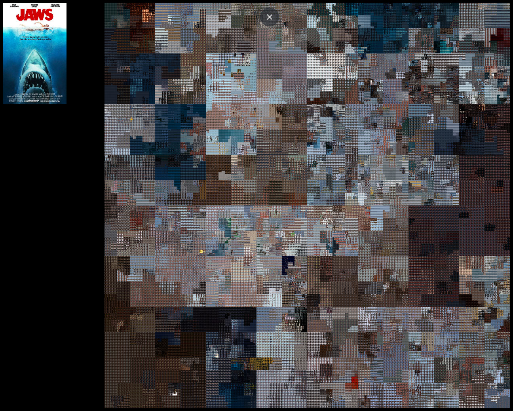

